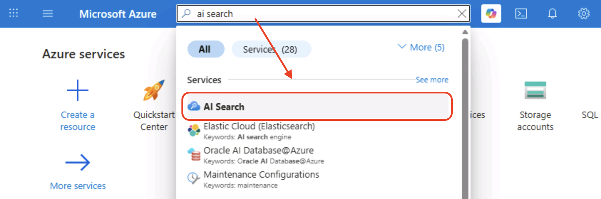
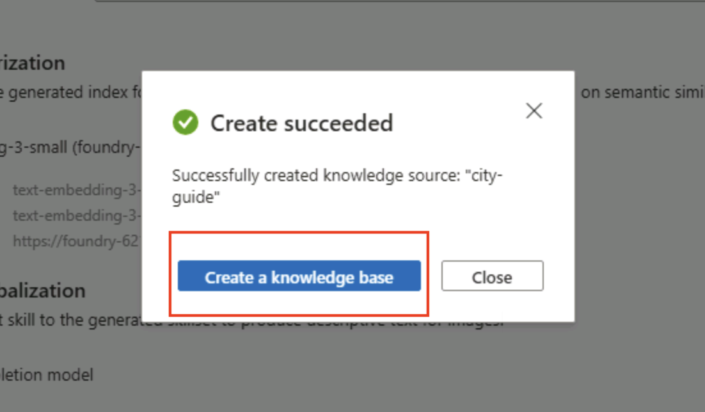
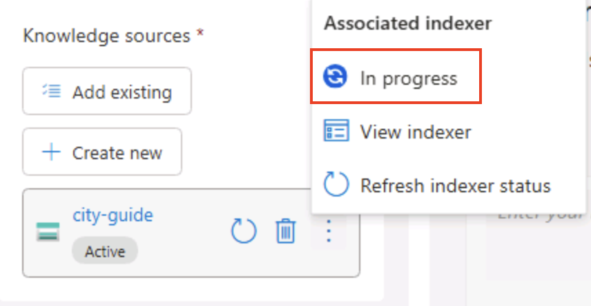
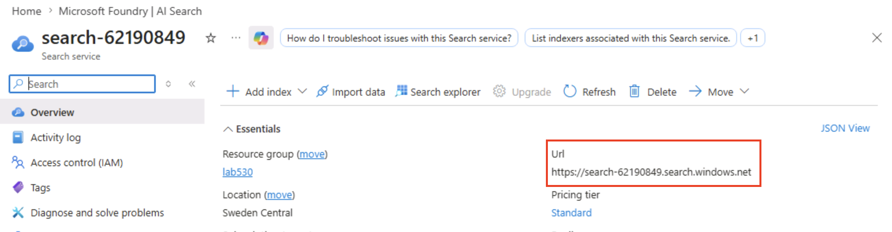
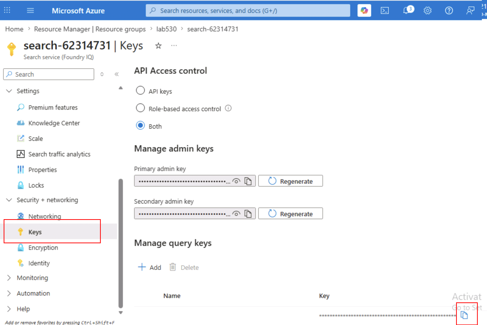

# Step 7: Test The City Guide Agent

In this exercise, you add knowledge to the workshop agent by testing a city guide
specialist in a separate file before wiring it into the main game agent. This
matters because guide missions should be solved with retrieval from the San
Francisco content instead of hard-coded answers or model guesses.

> [!Hint] 🌐 **In the browser — Azure portal** — you start in the Azure portal to set up search, then switch to VS Code to create the specialist agent.

The specialist uses an Azure AI Search knowledge base to retrieve relevant city
guide chapters at the moment it needs them. That lets the model answer from
workshop material instead of relying only on what it already knows. Keeping this
retrieval logic in a specialist agent also means the main game agent only spends
search tokens when a guide question appears.

### In the Azure portal, create the city guide knowledge source

The city guide chapters are already uploaded to Azure Blob Storage for this
workshop. The source files are in the **city-guide** folder in this repository,
and the uploaded blob container is named **city-guide**.

1. Open the Azure portal by opening a tab and navigating to **https://portal.azure.com**.
2. Type **AI Search** in the Search bar on top. Click on the first service type.
 
There should only be one AI Search resource available, click on it.
3. From the left pane, select **Agentic retrieval > Knowledge sources**.
4. Select **Add knowledge source > Add knowledge source**.
5. For the source type, select **Azure blob (Indexed)**.

> [!Hint] Do not select **Search index (Indexed)**. That option expects an
> existing Azure AI Search index with semantic configuration. If you see **No
> indexes with a default semantic configuration were found**, go back and choose
> **Azure blob (Indexed)** instead.

6. For **Name**, enter **city-guide**.
7. For **Description**, enter **A San Francisco city guide with neighborhood,history, food, culture, transit, and local knowledge**.
8. For **Storage account**, select the storage account from the dropdown. There
   should only be one option.
9. For **Blob Container**, select **city-guide**.
10. In the **Content extraction** section, set **Mode** to **Minimal**.
11. Select **Authenticate using managed identity**.
13. For **Managed identity type**, keep **System-assigned** selected.
14. Under **Enable text vectorization**, select **Add vectorizer**.
15. For the vectorizer kind, select **Microsoft Foundry**.
16. For **Subscription**, keep the workshop subscription selected.
17. For **Microsoft Foundry project**, select the project for the workshop.
	There should only be one option.
18. For **Model deployment**, select **text-embedding-3-small**.
19. For **Authentication type**, select **API key**.
20. Click **Save**.
21. Click **Create** to create the knowledge source.

When the **Create succeeded** dialog appears, it should say the **city-guide**
knowledge source was created successfully. Click **Create a knowledge base**.



### Creating the city guide knowledge base

1. For **Name**, enter **city-knowledgebase**.
2. For **Description**, enter **San Francisco city guide knowledge base for grounded workshop guide answers**.
3. Under **Knowledge sources**, make sure **city-guide** is added and active.
4. For **Retrieval reasoning effort**, select **Low**.
5. Under **Chat completion model**, select **Add model deployment**.
6. In the **Chat completion model** dialog, keep **Kind** set to **Microsoft Foundry**.
7. For **Subscription**, keep the workshop subscription selected.
8. For **Microsoft Foundry project**, select the project for the workshop.
   There should only be one option.
9. For **Model deployment**, select **gpt-4.1-mini**.
10. For **Authentication type**, select **API key**.
11. Click **Save**.
12. For **Output mode**, select **Answer synthesis**.
13. Click **Save** in the top-left corner.

Test the knowledge base in the Azure portal by asking:

```text
What is the name of the cocktail bar that was founded in 1907?
```

The answer should be **The cocktail bar founded in 1907 is the Comstock Saloon in North Beach**.

>[!Warning] If the answer is not found, you might need to wait for the associated indexer to be completed
> 

After the knowledge base is saved, collect the Azure AI Search values for
**.env**:

1. Go back to the AI Search resource page in the Azure portal.
2. Open **Overview** and copy the **Url** value. This is the value for
	**AZURE_SEARCH_ENDPOINT**.
	
3. Open **Security + Networking > Keys** and copy one of the **Query keys** at the bottom section.
    Make sure it is a **Query** and not an **Admin** key. 
	This is the value for **AZURE_SEARCH_KEY**.
	
4. Keep the knowledge base name **city-knowledgebase**. This is the value for
	**AZURE_SEARCH_KNOWLEDGE_BASE_NAME**.

> [!Hint] 🖥️ **In VS Code** — the portal work is done; the rest of this step happens in the VS Code editor and terminal.

Open the existing **.env** file. Confirm the city guide model deployment is
already set to **gpt-4.1-mini**, then add the Azure AI Search values:

```env
CITY_GUIDE_AZURE_OPENAI_DEPLOYMENT_NAME=gpt-4.1-mini

AZURE_SEARCH_ENDPOINT=https://<your-search-service>.search.windows.net
AZURE_SEARCH_KNOWLEDGE_BASE_NAME=city-knowledgebase
AZURE_SEARCH_KEY=<your-azure-ai-search-key>
```

The city guide specialist uses a smaller deployment than the main game agent.
Keep **CITY_GUIDE_AZURE_OPENAI_DEPLOYMENT_NAME** set to **gpt-4.1-mini** so this
agent uses the city guide deployment you validated earlier.

In the VS Code Explorer, create a file named **agent_city_guide.py** in
**C:\workshop**. Paste the full code below into **agent_city_guide.py** and save
the file. This is the second specialist agent. Its search context provider lives
here, so the main game agent does not spend RAG tokens on every turn.

```python-notype
"""City guide specialist agent for San Francisco knowledge-base questions."""

import asyncio
import os

from agent_framework import Agent
from agent_framework.azure import AzureAISearchContextProvider
from agent_framework.openai import OpenAIChatClient
from dotenv import load_dotenv


def build_city_guide_agent():
	client = OpenAIChatClient(
		azure_endpoint=os.environ["AZURE_OPENAI_ENDPOINT"],
		api_key=os.environ["AZURE_OPENAI_API_KEY"],
		model=os.environ["CITY_GUIDE_AZURE_OPENAI_DEPLOYMENT_NAME"],
	)

	# Search context belongs here, so the main game agent does not spend RAG tokens on every turn.
	search_context_provider = AzureAISearchContextProvider(
		endpoint=os.environ["AZURE_SEARCH_ENDPOINT"],
		knowledge_base_name=os.environ["AZURE_SEARCH_KNOWLEDGE_BASE_NAME"],
		api_key=os.environ["AZURE_SEARCH_KEY"],
		mode="agentic",
	)

	guide_agent = Agent(
		client=client,
		name="San Francisco City Guide Agent",
		instructions=(
			"Answer San Francisco city guide questions using the provided search context. "
			"Keep answers brief and return only the answer needed by the game."
		),
		context_providers=[search_context_provider],
	)
	return guide_agent, search_context_provider


def build_city_guide_tool():
	guide_agent, search_context_provider = build_city_guide_agent()

	# The main game agent calls this tool only for city guide questions.
	guide_tool = guide_agent.as_tool(
		name="ask_city_guide",
		description=(
			"Ask the San Francisco city guide knowledge base a question."
		),
		arg_name="question",
		arg_description="The city guide question to answer.",
	)
	return guide_tool, search_context_provider


async def main() -> None:
	load_dotenv(override=True)

	question = "What is the name of the cocktail bar that was founded in 1907?"
	guide_agent, search_context_provider = build_city_guide_agent()

	try:
		response = await guide_agent.run(question)
		print(response.text)
	finally:
		await search_context_provider.close()


if __name__ == "__main__":
	asyncio.run(main())
```

Run **agent_city_guide.py** from the VS Code terminal:

```powershell
python agent_city_guide.py
```

> **Checkpoint:** the city guide agent should answer using the AI Search
> knowledge base. The answer should mention **The cocktail bar founded in 1907 is
> the Comstock Saloon in North Beach**.

## What You Learned

You built and tested the city guide specialist that retrieves knowledge from an
Azure AI Search knowledge base before adding it to the main game agent.